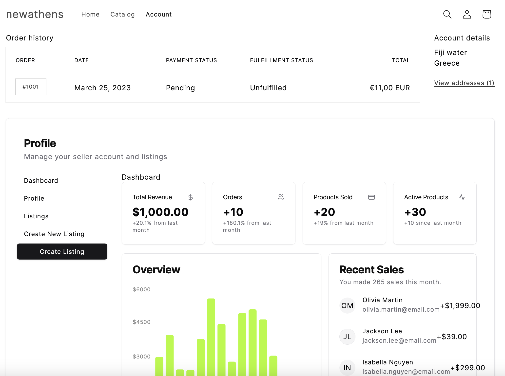
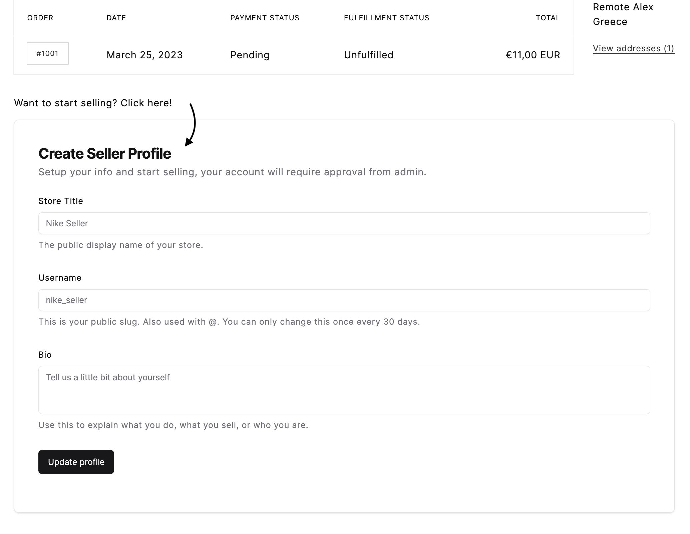

# Shopify Remix App Multivendor Metaobjects - WIP 🌐

### All contributions are welcome! 🙏
Refactor as much as you want, add new features, fix bugs, etc.
Since this was done as a demo and PoC for most of the time I didn't focus on the code quality and structure.

## Description 📝 
This is a shopify app that allows you to create a multivendor marketplace.
It uses metaobjects to create a vendor object that is connected to a collection.

The idea is that by using this app we will be able to create a multivendor marketplace that is fully customizable and scalable easily with shopify.

## Setup 🛠
This app uses shopify's [remix app template](https://github.com/Shopify/shopify-app-template-remix) as a base. 
Also, it uses shopify [react vite](https://github.com/montalvomiguelo/theme-extension-vite) as a base for the frontend, theme app extension.

1. `pnpm i`
2. `pnpm run dev`
3. Open a new terminal and go to  
4. `cd extensions/account-page && pnpm i && pnpm vite:dev`
5. To deploy the extension changes, `pnpm vite:build` in the extension folder and then `shopify deploy in the root`
6. Important for theme app extension: change the proxy url in the shopify app settings to your updated cloudflare url

## To Do 📝

### Frontend Seller
- [ ] Create new product - huge
  - [X] New product 
  - [X] Use staged upload to upload images
  - [x] Product variants
    - [X] Add variants
    - [x] GraphQL Variants
  - [ ] Edit product
  - [ ] Google feed XML update products ? _[future]_
  - [x] Add product images
  - [x] Categories 
  - [x] Product qty set
  - [x] Product options and variants from admin settings
- [ ] Dashboard - connection with real data
  - [ ] Orders
    - [x] Graphql get Order data
  - [ ] Shipping
  - [ ] Sold products, statistics etc
- [ ] Shipping - let vendor add shipping costs on their products
- [x] User settings
  - [ ] Disable vendor button (webhook)
  - [ ] Locations to handle
  - [ ] Setup a way to get payments
- [x] Setup profile
  - [x] Profile Request
  - [x] Profile Image
  - [x] Theme app extension for profile
  - [x] Setup handle + SEO description for vendor - collection pages
  - [x] Bio, socials, titles etc & info

### Frontend Theme app extensions
- [x] Extension for product page - vendor info
- [x] Extension for product page bottom - related products
- [X] Extension for collection page
- [x] Extension for account page/or related page

### Admin
- [x] Orders Page
  - [x] Add vendor to order
  - [x] Show payouts block and tags on admin order
- [ ] Setup Payouts page 
  - [x] Connect orders with vendors and calculate payouts
  - [ ] Automatic payouts stripe (later)
- [ ] Send email for new vendor setup + approved 
  - [X] Email ResendAPi 
  - [ ] Email templates
- [ ] Settings - categories, variants, commission, shipping etc
  - [x] Mass update settings from state
  - [x] Variants setup
  - [x] Options for Variants setup modal 
  - [x] Commission
- [ ] Approve Products manually
  - [x] Page to Approve products (?)
  - [x] Add settings for selecting auto approval
  - [ ] Specific Vendor auto approve their products
- [x] Approve vendors
  - [x] Add approval status
  - [x] collection template + app block with dynamic info ?
  - [x] Webhook -> after approve create auto collection for products with vendorID?
- [x] Show vendor data and redirect to meta object 

### Webhooks 
- [x] New vendor - create collection
- [ ] Edit vendor - update collection 
- [ ] Disable vendor - disable collection & products
- [ ] Admin disables product - notify vendor
- [ ] New order notify vendor
- [ ] Vendor creates new product - notify admin?
- [x] New order, add vendor to order
